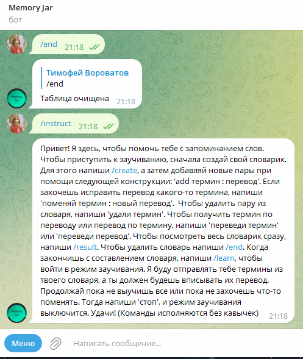

# Бот для заучивания слов и терминов

---

---

## Описание проекта
В рамках данной работы я создал телеграм-бота, способного через взаимодействие с базой данных MySql создавать для пользователя библиотеку персональных таблиц из пар термин : значение, а затем выполнять с ними различные манипуляции. Полный список команд бота таков:

* **create** *имя-таблицы* - создает новую пустую таблицу;
* **use** *имя-таблицы* - делает выбранную таблицу активной;
* *термин* : *значение* - добавляет в активную таблицу пару термин-значение;
* **get** *слово* - возвращает пару для *слова* из активной таблицы;
* **del** *слово* - удаляет пару со *словом* из активной таблицы;

* **/instruct** - вызывает инструкцию по эксплуатации бота;
* **/tables** - показывает список созданных таблиц;
* **/result** - показывает все пары слов из активной таблицы;
* **/drop** - удаляет активную таблицу;
* **/learn** - запускает режим заучивания, в котором пользователь может попрактиковаться и проверить, насколько хорошо он помнит слова в активной таблице.
Чтобы выйти из режима заучивания, требуется ввести команду **stop**.

Боту также можно отправить текстовый файл, где на каждой сточке будет пара *термин* : *значение*, чтобы он добавил эти слова в активную таблицу.

Режим заучивания является основной функцией бота, поскольку он позволяет не просто хранить слова в словаре, но и целенаправленно заучивать их. После активации режима бот начинает в случайном порядке отправлять пользователю термины из его активной таблицы и просит написать перевод. Процесс продолжается, пока пользователь не напишет "**stop**". После выхода из режима заучивания пользователь получает статистику о количестве своих правильных и неправильных ответов.

Бот позволяет каждому пользователю создавать и заполнять неограниченно много таблиц, что отлично подходит людям, изучающим сразу несколько языков или желающим учить термины по тематическим блокам.

---

Для взаимодействия с telegramAPI использовалась библиотека telebot, а для взаимодействия с БД mysql.connector.

---

Попробовать бота в деле можно по ссылке: https://t.me/wishmasBot
